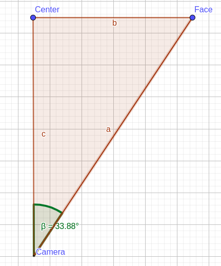

# Ước tính góc

## Description

1. Ước tính góc lệnh của khuôn mặt trên camera so với chính giữa camera

1. Thực hiện theo các bước:

   

   - Ước tính khoảng cách khuôn mặt đến camera (cạnh a)

   - Ước tính tỷ lệ độ lệnh khuôn mặt so với chính giữa camera (cạnh b)

   - Tính góc beta theo công thức lượng giác

## Problem

Không ước tính được tỷ lệ độ lệnh khuôn mặt so với camera


## Prerequisites

- run in ubuntu 20.04 or newer

- install python >= 3.8.5

  ```sh
  sudo apt-get update
  sudo apt-get install python3
  ```

- install pip

  ```sh
  sudo apt install -y python3-pip
  ```

## Installation

- Clone the repository

  ```sh
  git clone https://github.com/thaiph99/face-detector-using-cpp.git
  ```

- Install requirement packages

  ```sh
  pip install -r requirements.txt
  ```

## Citation

- [Paper for face detection](https://arxiv.org/abs/1512.02325)
- [Lib cpp open source](https://github.com/thaiph99/libdetection)

## Contact

Phạm Hồng Thái - [@thaiph99](https://fb.com/thaiph99) - thaiph99@gmail.com

Project Link: [Github](https://github.com/thaiph99/face-detector-using-cpp)
